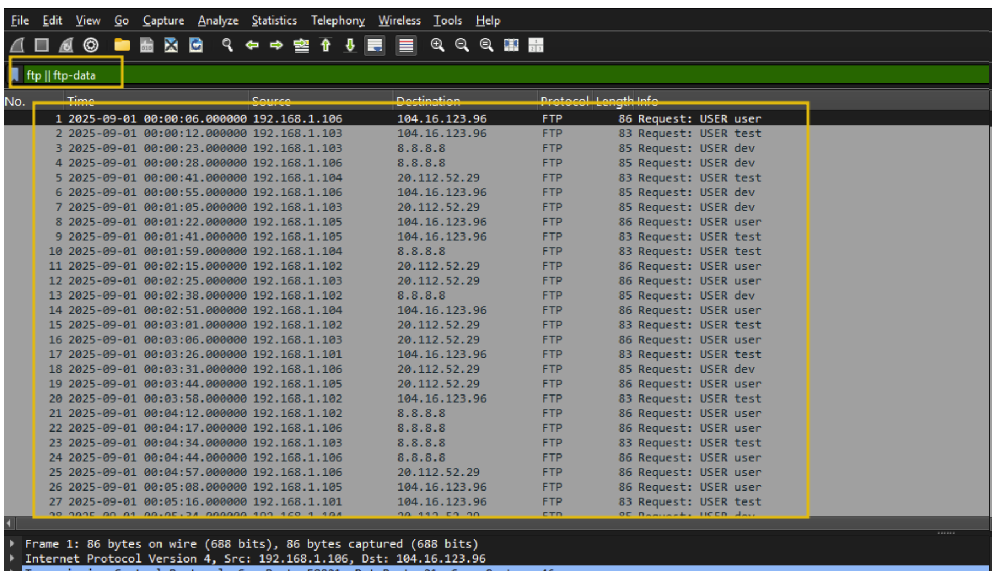
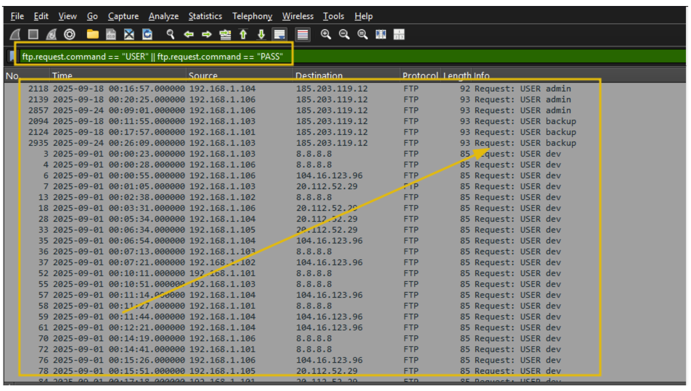
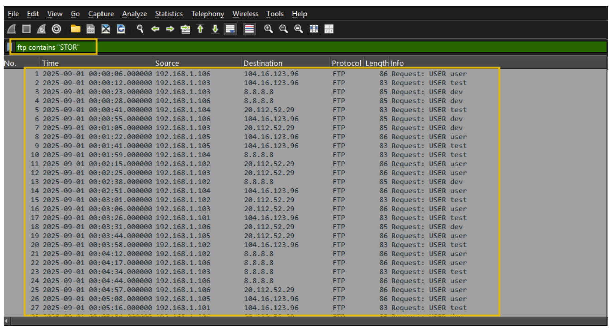
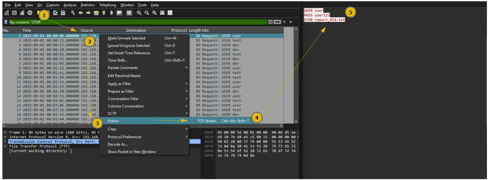

**Data Exfiltration Detection**

`DNS Exfiltration và DNS Tunneling`

DNS Exfiltration là kỹ thuật lợi dụng giao thức DNS để đánh cắp hoặc truyền dữ liệu ra ngoài mạng. Thay vì gửi dữ liệu trực tiếp qua HTTP, FTP hoặc các giao thức dễ bị giám sát, kẻ tấn công mã hóa dữ liệu rồi nhúng vào các truy vấn hoặc phản hồi DNS.

DNS thường được phép đi qua firewall vì hầu hết máy tính đều cần DNS để phân giải tên miền, ví dụ như chuyển example.com thành địa chỉ IP. Do đó, DNS trở thành một kênh bí mật hấp dẫn để che giấu việc truyền dữ liệu.

DNS Tunneling là kỹ thuật tạo một kênh truyền dữ liệu ẩn bên trong lưu lượng DNS.

DNS bình thường có nhiệm vụ phân giải tên miền thành địa chỉ IP và hỗ trợ nhiều loại bản ghi khác nhau như:

A      : ánh xạ tên miền sang IPv4
AAAA   : ánh xạ tên miền sang IPv6
TXT    : chứa dữ liệu dạng văn bản
MX     : máy chủ mail
CNAME  : bí danh tên miền

Một số đặc điểm quan trọng của DNS:

- Hầu hết máy tính đều gửi truy vấn DNS.
- DNS thường được firewall cho phép đi ra ngoài.
- DNS chủ yếu dùng UDP port 53.
- TCP port 53 thường dùng cho zone transfer hoặc phản hồi DNS có kích thước lớn.

`Vì sao attacker dùng DNS để exfiltration?`

Kẻ tấn công thường lợi dụng DNS vì:

- DNS là dịch vụ gần như luôn hoạt động.
- Lưu lượng DNS nhìn bên ngoài có vẻ bình thường.
- DNS thường ít bị kiểm tra kỹ so với HTTP/HTTPS.
- Dữ liệu có thể được mã hóa rồi nhúng vào subdomain.
- Một số loại bản ghi như TXT có thể chứa dữ liệu dài hơn bình thường.

Ví dụ dữ liệu bị đánh cắp có thể được chia nhỏ và nhúng vào subdomain:

dGhpcy1pcy1zZWNyZXQtZGF0YQ.attacker-domain.com

Trong đó phần subdomain dài phía trước có thể là dữ liệu đã được mã hóa bằng Base32 hoặc Base64.

`Dấu hiệu nhận biết DNS Exfiltration`

Khi phân tích lưu lượng DNS, ta cần chú ý các dấu hiệu sau:

1. Nhiều truy vấn DNS đến cùng một domain bên ngoài

Nếu một máy nội bộ gửi rất nhiều truy vấn DNS đến cùng một domain lạ, đây có thể là dấu hiệu dữ liệu đang bị truyền ra ngoài.

Ví dụ:

host1 -> abc123.attacker.com
host1 -> def456.attacker.com
host1 -> ghi789.attacker.com

Các subdomain thay đổi liên tục, nhưng domain chính vẫn giống nhau.

2. Tên miền hoặc subdomain quá dài

DNS exfiltration thường nhúng dữ liệu vào subdomain, nên tên miền truy vấn có thể dài bất thường.

Ví dụ đáng nghi:

aGVsbG93b3JsZHRoaXNpc2RhdGF0b2V4Zmls.attacker.com

Nếu query name dài hơn khoảng 60–100 ký tự, cần kiểm tra kỹ.

3. Chuỗi có entropy cao

Các chuỗi mã hóa thường nhìn rất ngẫu nhiên, chứa nhiều chữ cái, chữ số hoặc ký tự giống Base32/Base64.

Ví dụ:

MZXW6YTBOIXXE33ON5SSA3LBNRXXA.attacker.com

Dấu hiệu thường gặp:

- Nhiều ký tự ngẫu nhiên
- Không giống tên miền bình thường
- Có dạng Base32 hoặc Base64
- Subdomain thay đổi liên tục

`FTP Exfiltration`

FTP (File Transfer Protocol) là một trong những giao thức lâu đời dùng để truyền file giữa client và server trong mạng TCP/IP.

Trong tấn công mạng, attacker có thể lợi dụng FTP để chuyển một lượng lớn dữ liệu ra khỏi hệ thống. Việc này có thể xảy ra thông qua tài khoản bị đánh cắp, FTP server cấu hình sai, hoặc các tài khoản tạm thời được tạo ra để phục vụ quá trình exfiltration

`Cách attacker sử dụng FTP để đánh cắp dữ liệu`

Attacker có thể dùng FTP cho mục đích exfiltration theo nhiều cách:

- Sử dụng FTP server hợp lệ để upload dữ liệu đánh cắp.
- Lợi dụng FTP server public hoặc FTP server cấu hình sai.
- Dùng thông tin đăng nhập bị lộ hoặc bị đánh cắp.
- Dùng tài khoản service account hoặc tài khoản người dùng hợp lệ.
- Chạy FTP trên port không chuẩn để tránh bị chú ý.
- Kết hợp tunneling để che giấu lưu lượng FTP.

Do FTP có thể truyền file lớn, attacker thường dùng nó để đưa dữ liệu như tài liệu nội bộ, file nén, cơ sở dữ liệu hoặc log ra ngoài mạng.

`Dấu hiệu nhận biết FTP Exfiltration`

Khi phân tích lưu lượng FTP, cần chú ý các dấu hiệu sau:

1. USER và PASS command

FTP truyền thống không mã hóa dữ liệu, vì vậy thông tin đăng nhập có thể xuất hiện dưới dạng cleartext.

Các command đáng chú ý:

USER
PASS

Ví dụ:

USER admin
PASS password123

Nếu thấy thông tin đăng nhập FTP xuất hiện trong packet capture, cần kiểm tra xem tài khoản đó có hợp lệ không và có bị lạm dụng không.

2. STOR và RETR command

Hai command quan trọng trong FTP là:

STOR : upload file từ client lên server
RETR : download file từ server về client

Trong điều tra exfiltration, command STOR đặc biệt đáng chú ý vì nó cho thấy máy nội bộ đang upload dữ liệu ra FTP server.

Ví dụ:

STOR company_data.zip

Nếu thấy nhiều lệnh STOR, hoặc upload các file có kích thước lớn, đây có thể là dấu hiệu dữ liệu đang bị đưa ra ngoài.

First, we will look for FTP Sessions using the ftp || ftp-data filter

Let's filter to show only login attempts with USER/PASS:ftp.request.command == "USER" || ftp.request.command == "PASS"  

Filter: ftp contains "STOR" 

Right-click a packet → Follow → TCP Stream, as shown below:

