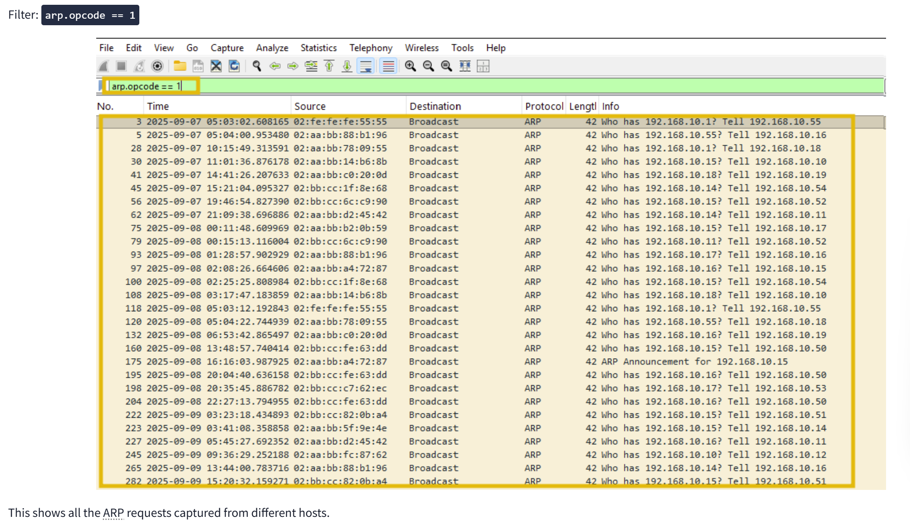
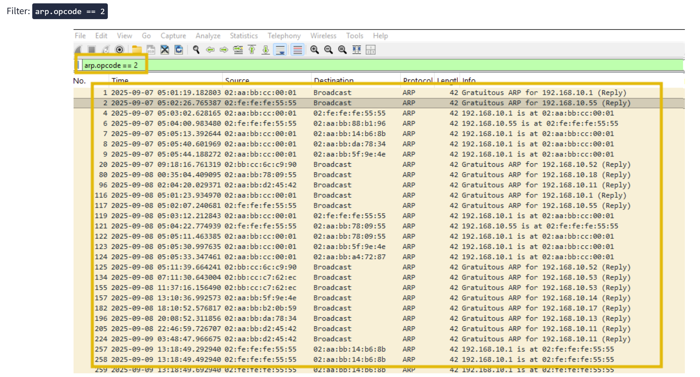

**Man-in-the-Middle Detection**

`Các loại MITM Attack phổ biến`
1. Packet Sniffing

Packet sniffing là kỹ thuật bắt các gói tin truyền qua mạng để đọc dữ liệu bên trong.

Kỹ thuật này đặc biệt nguy hiểm khi dữ liệu không được mã hóa, ví dụ như HTTP, FTP, Telnet hoặc mạng Wi-Fi công cộng không an toàn.

Ví dụ:

Người dùng đăng nhập qua HTTP
Attacker bắt packet
Attacker đọc được username và password

2. Session Hijacking

Session hijacking là kỹ thuật đánh cắp session token hoặc cookie phiên đăng nhập của người dùng.

Sau khi có session token, attacker có thể giả mạo người dùng mà không cần biết mật khẩu.

Ví dụ:

Người dùng đã đăng nhập website
Attacker đánh cắp session cookie
Attacker dùng cookie đó để truy cập như người dùng thật

3. SSL Stripping

SSL stripping là kỹ thuật hạ cấp kết nối từ HTTPS xuống HTTP.

Bình thường, HTTPS giúp mã hóa dữ liệu giữa trình duyệt và website. Nhưng nếu attacker ép nạn nhân dùng HTTP, dữ liệu có thể bị đọc hoặc chỉnh sửa.

Ví dụ:

Người dùng muốn truy cập https://example.com
Attacker làm nạn nhân truy cập http://example.com
Dữ liệu đăng nhập bị truyền dưới dạng không mã hóa

4. DNS Spoofing

DNS spoofing là kỹ thuật giả mạo phản hồi DNS để chuyển hướng người dùng đến website giả.

Ví dụ:

Người dùng truy cập bank.com
DNS giả trả về IP của website giả mạo
Người dùng bị đưa đến trang fake login
Attacker đánh cắp thông tin đăng nhập

5. IP Spoofing

IP spoofing là kỹ thuật tạo gói tin có địa chỉ IP nguồn giả mạo, khiến gói tin trông như đến từ một hệ thống đáng tin cậy.

Kỹ thuật này có thể được dùng để vượt qua một số cơ chế kiểm soát dựa trên IP hoặc hỗ trợ các cuộc tấn công khác.

7 giai đoạn của Cyber Kill Chain
1. Reconnaissance

Attacker thu thập thông tin về mục tiêu để tìm điểm yếu.

Ví dụ:

- Thu thập domain
- Tìm IP public
- Tìm email nhân viên
- Quét port và dịch vụ
2. Weaponization

Attacker kết hợp mã khai thác với payload độc hại để tạo thành công cụ tấn công.

Ví dụ:

- Tạo file độc hại
- Chuẩn bị exploit
- Gắn mã độc vào tài liệu hoặc link
3. Delivery

Attacker gửi payload đến môi trường mục tiêu.

Ví dụ:

- Gửi email phishing
- Gửi file đính kèm độc hại
- Gửi link độc hại
- Đưa mã độc qua website bị kiểm soát
4. Exploitation

Payload được kích hoạt và khai thác lỗ hổng để giành quyền truy cập ban đầu.

Lỗ hổng có thể là:

- Lỗi phần mềm
- Cấu hình sai
- Giao thức mạng thiếu bảo vệ
- Người dùng bấm vào link hoặc mở file độc hại
5. Installation

Attacker cài đặt malware, backdoor hoặc công cụ để duy trì quyền truy cập.

Ví dụ:

- Cài RAT
- Tạo persistence
- Cài web shell
- Thêm scheduled task
6. Command and Control

Attacker thiết lập kênh liên lạc bí mật để điều khiển máy đã bị xâm nhập.

Ví dụ:

- Máy nạn nhân kết nối đến C2 server
- Beacon định kỳ
- Nhận lệnh từ attacker
7. Actions on Objectives

Attacker thực hiện mục tiêu cuối cùng.

Ví dụ:

- Đánh cắp dữ liệu
- Mã hóa dữ liệu để tống tiền
- Phá hoại hệ thống
- Di chuyển ngang trong mạng
- Tạo thêm tài khoản trái phép

`MITM trong giai đoạn Exploitation`

Trong giai đoạn Exploitation, attacker có thể lợi dụng điểm yếu trong các giao thức mạng như ARP, DNS hoặc HTTP để chen vào giữa luồng giao tiếp.

Ví dụ:

- ARP spoofing để giả mạo gateway
- DNS spoofing để chuyển hướng domain
- SSL stripping để hạ HTTPS xuống HTTP

Khi attacker chặn được luồng giao tiếp, họ có thể nghe lén, đánh cắp session hoặc chỉnh sửa dữ liệu. Đây là một dạng khai thác vì nó phá vỡ tính toàn vẹn và tin cậy của mạng.

`MITM trong giai đoạn Installation`

Sau khi attacker đã đứng được ở vị trí trung gian, họ có thể dùng luồng dữ liệu đó để phát tán payload độc hại.

Ví dụ:

- Chèn mã độc vào file tải xuống qua HTTP
- Chèn browser exploit vào trang web
- Thay file hợp lệ bằng malware dropper
- Phát tán RAT thông qua download không mã hóa

Hành động này thuộc giai đoạn Installation, vì attacker đang cố gắng cài thêm mã độc hoặc thiết lập quyền truy cập lâu dài trên máy nạn nhân.

`ARP Requests`

`ARP Response`

