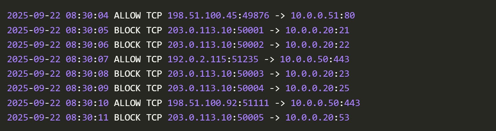
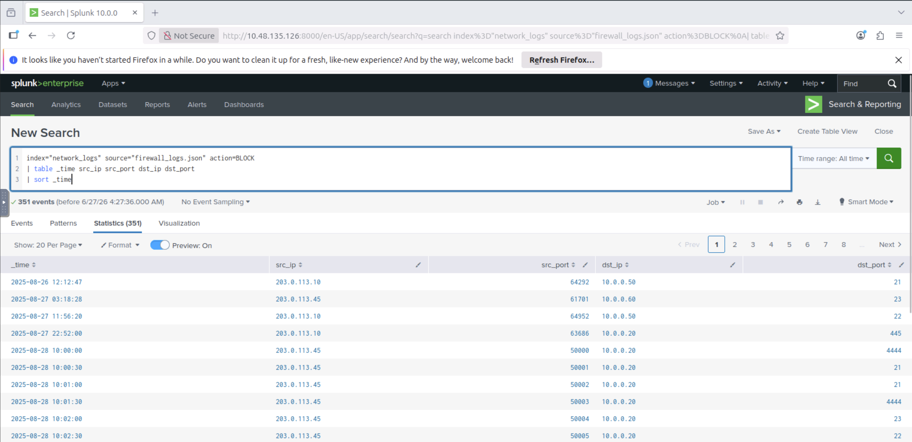
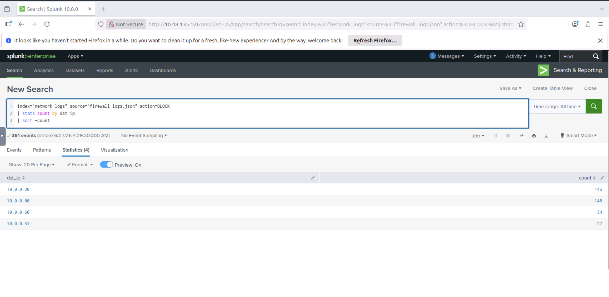

**Phishing Analysis Tool**

Mail Header Analysis 

- Messageheader là một công cụ của Google Admin Toolbox giúp phân tích tiêu đề email, bạn có thể nhanh chóng trích xuất dữ liệu như là địa chỉ IP người gửi, bộ định tuyến và các cấu hình sai tiềm năng

  

- Message Header Analyzer cũng có thể phân tích 

IP and URl Reputation Analysis

- IPinfo là một công cụ và hiệu quả cho việc thu thập thông tin về địa chỉ IP 

- URLScan.io là một công cụ cho phép các nhà phân tích điều tra các trang web một cách an toàn mà không cần thiết truy cập trực tiếp vào chúng

- IP & Domain Reputation Center cũng là một tool hiệu quả 

Mail Body Analysis

- URL extraction tool là tool để xác định URL trong email. Công cụ này cho phép dán nội dung email và tự động phân tích tất các liên kết nhúng

- Nếu email có đính kèm tệp, bạn có thể kiểm tra bằng các trích xuất mã băm sha256sum của tệp đính kèm đó sau đó kiểm tra trên VirusTotal 

Malware Sandboxes 

- ANY.RUN là một môi trường thử nghiệm phần mềm độc hại tương tác cho phép các nhà phân tích thực thi và quan sát các tệp và URL đáng ngờ một cách an toàn 

- Hybrid Analysis là một sandbox phân tích mã độc miễn phí cho phép các nhà phân tích tải lên và kiểm tra các file đáng ngờ trong môi trường được kiểm soát

