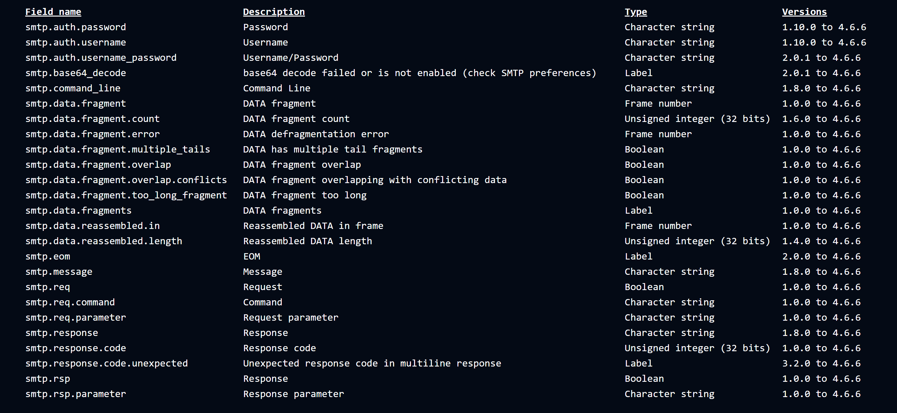
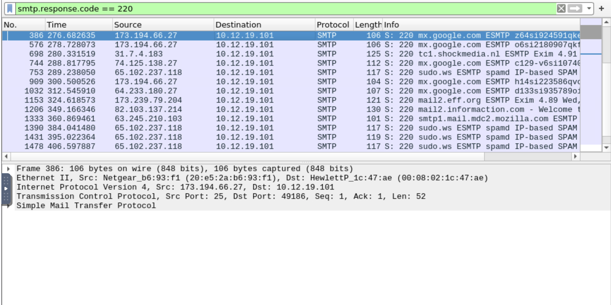
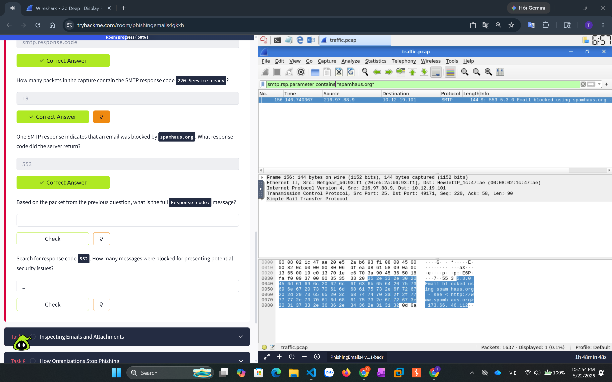

**Phishing Prevention**

- DMARC là một cơ chế giúp chống giả mạo email.

- Nó hoạt động bằng cách kết hợp SPF và DKIM để kiểm tra email có thực sự được gửi từ đúng tên miền hay không 

    - SPF: kiểm tra máy chủ gửi email có được phép gửi mail cho domain đó hay không 

    - DKIM: kiểm tra xem email có bị sửa nội dung trong quá trình gửi hay không

- DMARC sẽ kiểm tra kết quả của SPF và DKIM có khớp với domain người gửi hay không 

- Nếu không khớp, DMARC sẽ quyết định xử lý email đó theo chính sách đã cấu hình 

```DMARC Record```

- Ví dụ một bản ghi DMARC: v=DMARC1; q=quarantine; rua=mailto:postmaster@website.com

Ý nghĩa từng thành phần

- v=DMARC1: 

    - Phiên bản của DMARC 

    - Đây là phần bắt buộc phải có 

- p=quarantine

    - Chính sách xử lý email khi kiểm tra DMARC thất bại.

    - quarantine nghĩa là:

        - Email sẽ bị đưa vào thư mục spam/quarantine.

-  Ngoài ra còn có:

    - p=none

        - Chỉ ghi nhận, chưa chặn email.

    - p=reject

        - Từ chối hoàn toàn email giả mạo.

rua=mailto:postmaster@website.com

    - Địa chỉ email nhận báo cáo DMARC.

    - Máy chủ mail sẽ gửi thống kê các email bị fail DMARC về email này.

```Domain Checker```

- Có những công cụ dùng để kiểm tra cấu hình:

    - SPF

    - DKIM

    - DMARC 

của một domain có đúng hay không

- Ví dụ kiểm tra microsoft.com, công cụ sẽ cho biết:

    - DMARC có hoạt động không

    - SPF/DKIM có pass không

    - Chính sách đang dùng là gì (none, quarantine, reject)

Nếu domain dùng: p=reject thì các email giả mạo domain đó sẽ bị chặn hoàn toàn.

```S/MIME``` 

- S/MIME là chuẩn bảo mật email dùng để

    - Ký số email (Digital Signature)

    - Mã hóa email (Encryption)

- Mục tiêu:

    - Xác minh đúng người gửi

    - Đảm bảo email không bị sửa

    - Giữ nội dung email bí mật 

- S/MIME hoạt động dựa trên mật mã khóa công khai(Public Key Cryptography)

- Public Key Cryptography hoạt động như thế nào

- Mỗi người sẽ có:

    - Public Key (khóa công khai)

    - Private Key (khóa bí mật)

- Nguyên tắc: 

    - Mã hóa bằng Public Key

        -> chỉ giải mã được bằng private key tương ứng

    - Ký bằng Private Key 

        -> kiểm tra được bằng public key    

```Digital Signature```

Người gửi dùng Private Key để ký email

Người nhận dùng public key để kiểm tra chữ ký 

Mục đích

    - Authetication: xác thực người gửi 

    - Non-repudiation: không thể chối bỏ

    - Data Integrity: phát hiện email bị sửa đổi

```Encryption```

Người gửi dùng public key của người nhận để mã hóa email 

Người nhận dùng private key để giải mã 

Mục đích

    - Confidentiality: đảm bảo chỉ người nhận đọc được email

Ví dụ: 

- Bob ký email bằng Private Key của mình

- Bob mã hóa email bằng Public Key của Mary

- Mary dùng Private Key của mình để giải mã

- Mary dùng Public key của Bob để kiểm tra chữ ký 

---------------------------------------------------------------------------------

- 1 số bộ lọc của giao thức smtp 



- Tìm gói tin smtp có response code = 220 






