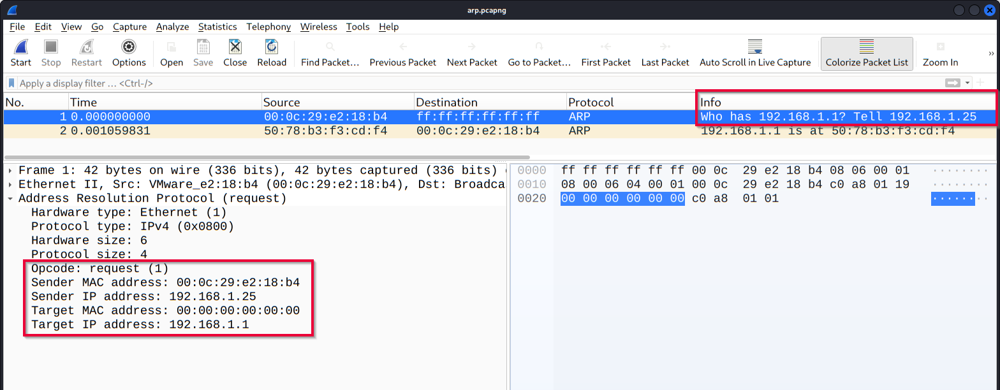
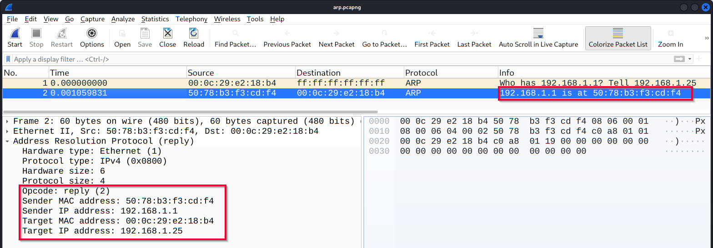
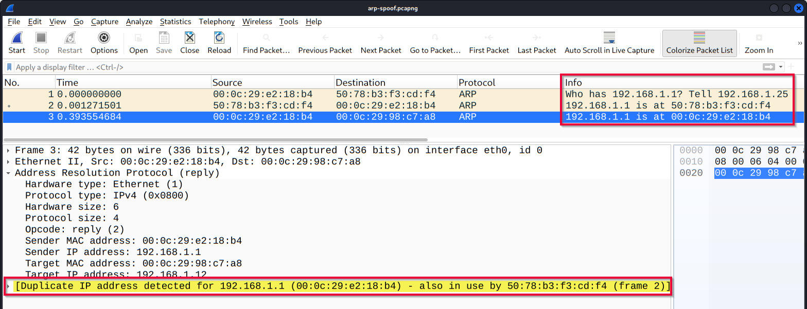
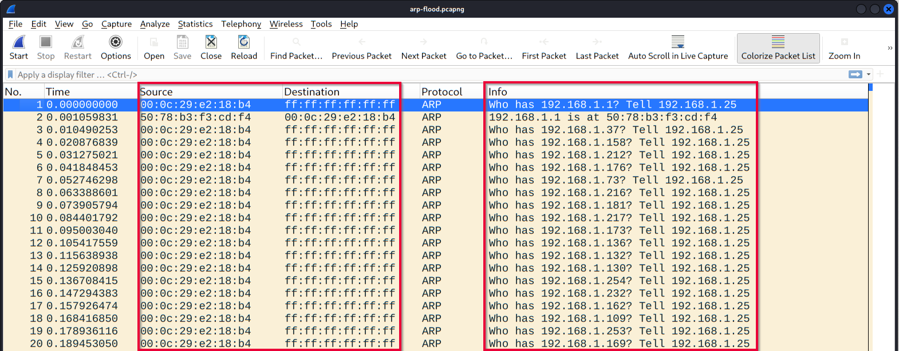

**Wireshark: The Basic**

`1. Use Cases của Wireshark`

Wireshark là công cụ phân tích traffic mạng (packet analyzer/sniffer).

Mục đích sử dụng

- Phát hiện và xử lý sự cố mạng

    - Network congestion (tắc nghẽn)

    - Điểm lỗi mạng

    - Kết nối chậm/mất kết nối

- Phát hiện bất thường bảo mật

    - Rogue host (thiết bị lạ)

    - Port usage bất thường

    - Traffic đáng ngờ

- Điều tra và học giao thức

    - HTTP response code

    - DNS request/response

    - Payload dữ liệu

Lưu ý 

    - Wireshark không phải IDS

    - Chỉ

        - đọc packet

        - phân tích packet

        - hỗ trợ điều tra

    - Không chặn hoặc sửa traffic

=> Khả năng phát hiện phụ thuộc vào kỹ năng analyst.

`2.Giao diện (GUI) của Wireshark`

Wireshark có nhiều khu vực chính:

*Toolbar*

Thanh công cụ chính.

Chức năng:

- Start/Stop capture

- Filter

- Sort

- Export

- Merge PCAP

- Điều hướng packet

*Display Filter Bar*

Thanh lọc packet 

Dùng để

- tìm packet 

- lọc protocol

- lọc IP/port

Ví dụ

```
http
dns
ip.addr == 192.168.1.10
tcp.port == 80
```

*Recent File*

Danh sách file PCAP gần đây 

- double click để mở lại

*Capture Filter & Interfaces* 

Chọn interface để sniff traffic 

Ví dụ interface:

```
eth0
ens33
lo (loopback)
docker0
```

Có thể đặt capture filter trước khi capture 

*Status Bar*

Hiển thị trạng thái:

- interface đang dùng 

- số packet 

- profile 

- trạng thái capture 

`3. Loading PCAP Files`

Mở file .pcap/.pcapng để phân tích.

Cách mở:

- File → Open

- Drag & Drop

- Double click file recent

`4. Cấu trúc màn hình phân tích packet`

Sau khi mở PCAP sẽ có 3 pane chính:

*Packet List Pane*

Danh sách packet.

Hiển thị:

- Source IP

- Destination IP

- Protocol

- Time

- Length

- Info

Ví dụ: 192.168.1.10 → 8.8.8.8 DNS

Chọn packet tại đây để xem chi tiết.

*Packet Details Pane*

Chi tiết packet theo protocol.

Ví dụ:

```
Ethernet
IP
TCP
HTTP
DNS
```

Cho biết:

- header

- field

- flag

- port

- sequence number

*Packet Bytes Pane*

Hiển thị dữ liệu packet dạng:

- Hex

- ASCII

Giúp:

- xem payload

- kiểm tra dữ liệu raw

`5. Colouring Packets (Tô màu packet)`

Wireshark tô màu packet để dễ nhận biết protocol/bất thường.

Giúp:

- nhìn nhanh protocol

- phát hiện anomaly

- phân biệt loại traffic

Ví dụ:

- TCP

- UDP

- HTTP

- ICMP

- ARP

`6. View File Details`

Xem thông tin file PCAP.

Dùng khi:

- có nhiều PCAP

- cần phân loại

- cần xác minh metadata

Đường dẫn: Statistics → Capture File Properties

---------------------------------------------------------------------------------

`1. ARP là gì`

ARP (Address Resolution Protocol) dùng để: đổi IP Address → MAC Address

Vì trong mạng LAN máy tính gửi dữ liệu bằng MAC, nên trước khi gửi phải biết: “IP này có MAC là gì?”

Ví dụ: 192.168.1.1 → 50:78:b3:f3:cd:f4

`2. ARP Request`



Trong ảnh: Who has 192.168.1.1? Tell 192.168.1.25

Ý nghĩa: Máy 192.168.1.25 đang hỏi:

“Ai là 192.168.1.1? trả lời cho tôi”

Nhìn phần detail: Sender IP: 192.168.1.25 Target IP: 192.168.1.1

Tức là: 192.168.1.25 → hỏi MAC của 192.168.1.1

Điểm cần nhớ:

opcode = 1 (request)
gửi broadcast

Destination: ff:ff:ff:ff:ff:ff

nghĩa là: gửi cho toàn mạng hỏi.

Filter: arp.opcode == 1

`3. ARP Reply`



192.168.1.1 is at
50:78:b3:f3:cd:f4

Nghĩa là:

Máy 192.168.1.1 trả lời:

“Tôi đây, MAC của tôi là 50:78:b3:f3:cd:f4”

Nhìn detail:

Sender IP: 192.168.1.1
Sender MAC: 50:78:b3:f3:cd:f4

=> ánh xạ:

192.168.1.1
↓
50:78:b3:f3:cd:f4

Điểm cần nhớ:

opcode = 2 (reply)
trả lời trực tiếp cho máy hỏi

Filter:

arp.opcode == 2

`4. ARP Spoofing`



Nhìn dòng này:

192.168.1.1 is at 50:78:b3:f3:cd:f4

router thật nói:

Tôi là 192.168.1.1

Nhưng ngay sau đó:

192.168.1.1 is at 00:0c:29:e2:18:b4

một MAC khác lại claim cùng IP.

=> attacker đang nói:

“Không không, tôi mới là 192.168.1.1 đây!”

Kết quả:

1 IP → 2 MAC

Đây là dấu hiệu lớn của:

ARP Spoofing / ARP Poisoning

Wireshark cảnh báo:

Duplicate IP address detected

Tức là:

phát hiện IP bị trùng.

Filter:

arp.duplicate-address-detected

`5. Tại sao spoofing nguy hiểm?`

Vì attacker giả làm gateway/router.

Ví dụ:

Router thật:

192.168.1.1

Attacker bảo:

“Tôi là router đây”

Lúc đó victim gửi traffic cho attacker.

Thay vì:

Victim → Router

sẽ thành:

Victim → Attacker → Router

Đây gọi là:

MITM (Man In The Middle)

`6. ARP Flooding`



Nhìn cột Info:

Who has 192.168.1.37
Who has 192.168.1.158
Who has 192.168.1.212
...

Một MAC liên tục hỏi:

“Ai là IP này?”

“Ai là IP kia?”

Ý nghĩa:

Attacker đang:

scan mạng
tìm máy sống
chuẩn bị spoof

Dấu hiệu:

quá nhiều ARP request trong thời gian ngắn

Ở đây:

00:0c:29:e2:18:b4

spam hàng loạt request.

=> đáng nghi.


